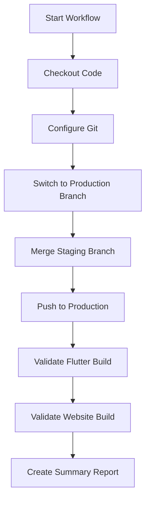

# HiPop GitHub Workflow Guide

This guide explains how to use the automated GitHub workflows for managing your staging and production environments.

## Overview

Your HiPop project uses GitHub Actions to automate:
- **Deployment**: Staging → Production merging
- **Validation**: Code quality and security checks
- **Testing**: Automated Flutter and website builds

## Workflows Available

### 1. Deploy Staging to Production
**File**: `.github/workflows/staging-to-production.yml`
**Purpose**: Safely deploy changes from staging to production

### 2. Pull Request Validation  
**File**: `.github/workflows/pr-validation.yml`
**Purpose**: Automatically validate all pull requests

## Production Deployment Workflow

### How to Deploy

1. **Navigate to GitHub Actions**
   - Go to your repository on GitHub
   - Click the "Actions" tab
   - Find "Deploy Staging to Production" in the workflow list

2. **Start Deployment**
   - Click "Run workflow" button
   - In the dropdown, type `DEPLOY` in the confirmation field
   - Click the green "Run workflow" button

3. **Monitor Progress**
   - Watch the workflow execute in real-time
   - Review each step as it completes
   - Check for any errors or warnings

### What the Workflow Does



**Step-by-Step Process:**

1. **Setup** (30 seconds)
   - Checks out the repository
   - Sets up Git configuration
   - Fetches all branches

2. **Merge** (1-2 minutes)
   - Switches to production branch
   - Merges staging branch with `--no-ff` flag
   - Creates merge commit with timestamp

3. **Deploy** (30 seconds)
   - Pushes merged changes to production branch
   - Updates GitHub repository

4. **Validation** (3-5 minutes)
   - Sets up Flutter environment
   - Runs `flutter pub get` and `flutter analyze`
   - Builds website with `npm run build`
   - Validates all builds are successful

5. **Reporting** (15 seconds)
   - Creates deployment summary
   - Lists all deployed changes
   - Shows commit information

### Deployment Safety Features

- **Manual Confirmation**: Requires typing "DEPLOY" to prevent accidents
- **Build Validation**: Ensures code compiles before deployment
- **Merge Commits**: Creates clear deployment history
- **Rollback Ready**: Easy to identify and revert deployments

## Pull Request Validation

### Automatic Triggers

The PR validation workflow runs automatically when you:
- Open a pull request to `main`, `staging`, or `production`
- Push new commits to an existing pull request
- Reopen a pull request

### What Gets Validated

**Flutter App Validation:**
- Dependency installation (`flutter pub get`)
- Code analysis (`flutter analyze`)
- Unit tests (`flutter test`)
- Build verification

**Website Validation:**
- NPM dependency installation
- Linting checks
- Production build test

**Security Checks:**
- Scans for accidentally committed secrets
- Validates `.gitignore` effectiveness
- Checks for sensitive files in wrong locations

### Understanding PR Check Results

**✅ All Checks Passed**
```
✅ Flutter validation: Passed
✅ Website validation: Passed  
✅ Security check: Passed
```
*Your PR is ready to merge!*

**❌ Some Checks Failed**
```
❌ Flutter validation: Failed
✅ Website validation: Passed
✅ Security check: Passed
```
*Fix Flutter issues before merging*

**⚠️ Checks Skipped**
```
✅ Flutter validation: Skipped (no Flutter changes)
✅ Website validation: Passed
✅ Security check: Passed
```
*Normal when only website files changed*

## Branch Structure

### Branch Workflow

```
main branch (development)
    ↓
    [Pull Request] → staging branch (testing)
    ↓  
    [Deploy Workflow] → production branch (live)
```

### Branch Purposes

- **`main`**: Development branch for new features
- **`staging`**: Testing branch that mirrors production
- **`production`**: Live production code

### Recommended Workflow

1. **Feature Development**
   ```bash
   git checkout main
   git pull origin main
   git checkout -b feature/new-feature
   # Make changes
   git commit -m "Add new feature"
   git push origin feature/new-feature
   ```

2. **Create Pull Request**
   - Open PR from `feature/new-feature` → `staging`
   - Wait for validation checks to pass
   - Get code review approval
   - Merge to staging

3. **Deploy to Production**
   - Use GitHub Actions workflow
   - Type "DEPLOY" to confirm
   - Monitor deployment progress

## Monitoring and Troubleshooting

### Viewing Workflow Results

1. **Go to Actions Tab**
   - Navigate to your repository
   - Click "Actions" tab
   - See all workflow runs

2. **Check Specific Run**
   - Click on a workflow run
   - Expand each step to see details
   - Look for red ❌ marks for failures

3. **Download Logs**
   - Click the gear icon on any workflow run
   - Select "Download log archive"
   - Extract and review detailed logs

### Common Issues and Solutions

**Deployment Fails: "Merge Conflicts"**
```
Solution: Manual merge required
1. Checkout staging branch locally
2. Merge main branch manually
3. Resolve conflicts
4. Push resolved changes
5. Re-run deployment workflow
```

**Deployment Fails: "Build Errors"**
```
Solution: Fix code issues
1. Check workflow logs for specific errors
2. Fix issues in staging branch
3. Push fixes
4. Re-run deployment workflow
```

**Security Check Fails: "Secrets Detected"**
```
Solution: Remove sensitive data
1. Check workflow logs for flagged content
2. Remove or obfuscate sensitive data
3. Update .gitignore if needed
4. Push clean version
```

**Flutter Validation Fails**
```bash
# Common fixes:
flutter clean
flutter pub get
flutter analyze --fix
flutter test
```

**Website Validation Fails**
```bash
# Common fixes:
cd hipop-website
npm install
npm run lint -- --fix
npm run build
```

### Workflow Status Badges

Add these to your README.md to show workflow status:

```markdown


```

## Customizing Workflows

### Modify Deployment Workflow

Edit `.github/workflows/staging-to-production.yml`:

```yaml
# To auto-deploy on staging pushes (remove manual trigger):
on:
  push:
    branches: [ staging ]

# To add Slack notifications:
- name: Notify Slack
  if: success()
  run: |
    curl -X POST -H 'Content-type: application/json' \
    --data '{"text":"🚀 Production deployment complete!"}' \
    ${{ secrets.SLACK_WEBHOOK_URL }}
```

### Add Environment-Specific Steps

```yaml
# Add staging-specific validation:
- name: Test with Staging Firebase
  run: |
    # Use staging Firebase project
    cd hipop
    flutter test integration_test/
```

## Security Best Practices

### Repository Secrets

Add these secrets in GitHub → Settings → Secrets:

- `FIREBASE_TOKEN`: For Firebase deployments
- `SLACK_WEBHOOK_URL`: For notifications
- `API_KEYS`: For external service integration

### Branch Protection

Recommended settings for `production` branch:
- ✅ Require pull request reviews
- ✅ Require status checks to pass
- ✅ Require branches to be up to date
- ✅ Include administrators in restrictions

## Quick Reference

| Action | Location | Purpose |
|--------|----------|---------|
| Deploy to Production | Actions → "Deploy Staging to Production" | Merge staging → production |
| View PR Checks | Pull Request → "Checks" tab | See validation results |
| Download Logs | Actions → Workflow Run → Gear Icon | Debug issues |
| Re-run Failed Jobs | Actions → Workflow Run → "Re-run jobs" | Retry after fixes |

## Advanced Usage

### Manual Workflow Dispatch

```bash
# Trigger deployment via API
curl -X POST \
  -H "Authorization: token $GITHUB_TOKEN" \
  -H "Accept: application/vnd.github.v3+json" \
  "https://api.github.com/repos/jwgillispie/hipop/actions/workflows/staging-to-production.yml/dispatches" \
  -d '{"ref":"main","inputs":{"confirm_deploy":"DEPLOY"}}'
```

### Scheduled Deployments

Add to workflow file for automatic deployments:

```yaml
on:
  schedule:
    - cron: '0 2 * * 1'  # Every Monday at 2 AM UTC
  workflow_dispatch:
    # ... existing manual trigger
```

---

**🔗 Related Guides:**
- [Environment Sync Guide](ENVIRONMENT_SYNC_GUIDE.md)
- [Local Development Setup](../scripts/setup-environment.sh)